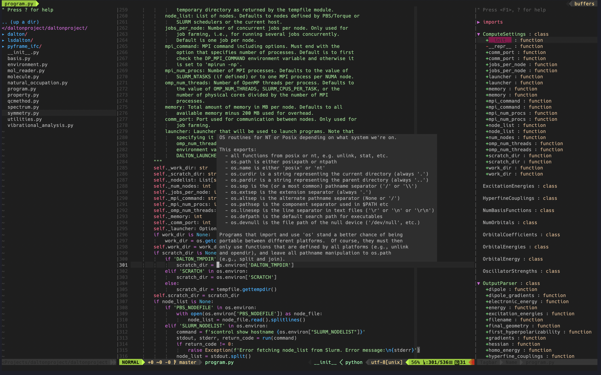

# vim-ide
This is the configure file used to config `Vim` as a Python IDE

The module used as follows:

    - 'VundleVim/Vundle.vim'               " let Vundle manage Vundle, required
    - 'scrooloose/nerdtree'                " Project and file navigation
    - 'majutsushi/tagbar'                  " Class/module browser
    - 'bling/vim-airline'                  " Lean & mean status/tabline for vim
    - 'vim-airline/vim-airline-themes'     " Themes for airline
    - 'Lokaltog/powerline'                 " Powerline fonts plugin
    - 'fisadev/FixedTaskList.vim'          " Pending tasks list
    - 'rosenfeld/conque-term'              " Consoles as buffers
    - 'SirVer/ultisnips'                   " Snippets
    - 'honza/vim-snippets'                 " snippets repo
    - 'Valloric/YouCompleteMe'             " Autocomplete plugin
    - 'junegunn/fzf', { 'do': { -> fzf#install() } }
    - 'junegunn/fzf.vim'"
    - 'dense-analysis/ale'                 " Real time linting
    - 'davidhalter/jedi-vim'               " Code navigation
    - 'tpope/vim-fugitive'
    - 'ervandew/supertab'                  " Fix conflict between NERDTREE and UltiSnips
    - 'jiangmiao/auto-pairs'               " Auto pairs
    - 'plasticboy/vim-markdown'
    - 'joshdick/onedark.vim'
    - 'airblade/vim-gitgutter'             " Atom theme
    - 'sheerun/vim-polyglot'               " multi color for different language
    - 'Yggdroot/indentLine'                " indent line

## Screenshot

